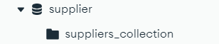
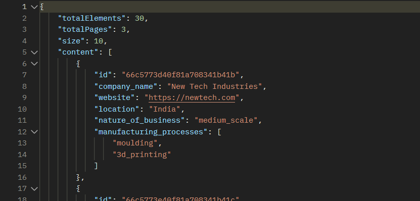

# STEPS TO RUN THE SUPPLIER BACKEND
    1. Clone the respository in the computer usign git clone command
    2. Open the terminal 
    3. Make sure you have java version 17 installed and mongoDb installed
    4. Run the mongoDB server
    5. Create a database with name supplier and create a collection in it with "suppliers_collection" as collection 
        and import the data from the suppliers.json to that collection using mongoDb compass

# The final schema will look like this
    6. Run the backend-application in terminal by typing:
        1. ./mvnw package
        The above command will create the Supplier-Backend.jar in the target folder
    7. After building the jar run the file using terminal command : java -jar supplier-backend.jar
    8. Open the terminal and paste the following curl command 
        cUrl command: curl -X POST 'http://localhost:8080/api/v1/supplier/query?page=1&size=10&location=India&nature_of_business=medium_scale&manufacturing_process=3d_printing'
    
# The final results will look like this

# Result image from postman
You can change the value of the pages if the result are many then it will show only the first 10 entries you can change the count from changing 
the size parameter in the cUrl url size parameter and page for changing the page
# FEATURES WE CAN ADD:
* We can also add more features like user authentication and implementing the spring security for authentication and authorization of the user
* We can implement the caching for the most frequent searched result
* Adding multiple search parameter to filter out the results having multiple criteria of search based on multiple location, nature_of_buisness
* Rating of the suppliers signifies the best supplier
* Review of the suppliers
* Avalaibility of the suppliers
* JWT for authorization of the user
